# Autoknit

A re-implementation of ["Automatic Machine Knitting of 3D Meshes"](https://textiles-lab.github.io/publications/2018-autoknit/).
Does not match the code used in the paper exactly, but is close in most regards.

## License

This code is placed in the public domain.

## Building

You will need Perforce's Jam/MR tool to build, along with the SDL2 library (opengl + mouse handling), the glm math library, and the Eigen linear algebra library.

### MacOS setup
```
#clone repository:
git clone git@github.com:textiles-lab/autoknit
cd autoknit
git submodule init
git submodule update

#install prerequisite libraries and build tool:
brew install ftjam sdl2 glm eigen
```

### Linux setup
TBD

### Window setup

First, install [ftjam](https://www.freetype.org/jam/) somewhere in your ```%path%``` so you can run it from a command prompt. (Also make sure that git is installed in such a way that it can be run from a command prompt.)

Then, from a ```Visual Studio 2017 > x64 Native Tools Command Prompt for VS 2017``` do:
```
#clone repository:
git clone git@github.com:textiles-lab/autoknit
cd autoknit
git submodule init
git submodule update

#install pre-built versions of sdl2 and glm libraries:
git clone git@github.com:ixchow/kit-libs-win
#get a copy of the Eigen headers:
git clone git@github.com:eigenteam/eigen-git-mirror eigen
```

### Linux/Windows/MacOS build
```
cd autoknit
jam -j8
```

The ```-j8``` parameter means to run up to 8 compilation jobs in parallel. You may wish to adjust this for your particular machine.

## Usage

Step-by-step instructions for creating knitting machine instructions for the [misc-cactus.obj](https://github.com/textiles-lab/autoknit-tests/raw/master/models/misc-cactus.obj) model from the [autoknit-tests](https://github.com/textiles-lab/autoknit-tests) repository.

### Step 1: Constraints

Launch the interface, telling it to load from ```misc-cactus.obj``` and to save constraints to ```misc-cactus.cons```:

```
./interface obj:misc-cactus.obj constraints:misc-cactus.cons
```

You will see a 3D view of the loaded model:

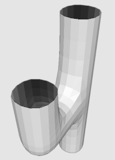

You can rotate this model with the right mouse button, zoom with the mouse wheel, and pan with <kbd>shift</kbd> + right mouse button.

The point on the surface your mouse is over will be highlighted with a grey sphere (the red, green, and blue spheres show the location of the corners of the triangle:

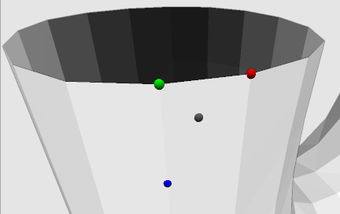

Pressing the <kbd>c</kbd> key will add a constraint:

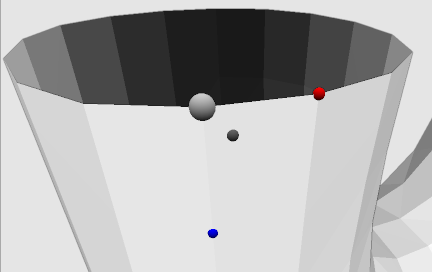

Pressing the <kbd>c</kbd> key while hovering over a constraint will add a connected constraint point, which you can press left mouse button to place:

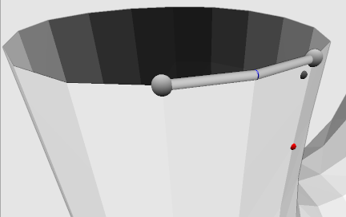

You can click and drag constraint points to move them:

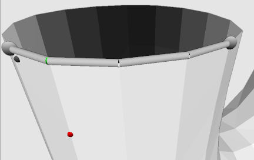

Pressing the <kbd>+</kbd> key while hovering over a constraint will move it later in time (redder) while pressing the <kbd>-</kbd> key will move it earlier in time (bluer):

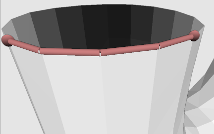

Pressing the <kbd>X</kbd> key while hovering over a constraint will delete it:

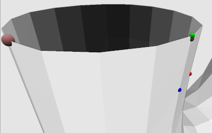

Before you can proceed to the next step, you will need to create constraints for (at least) all of the boundaries of the cactus:

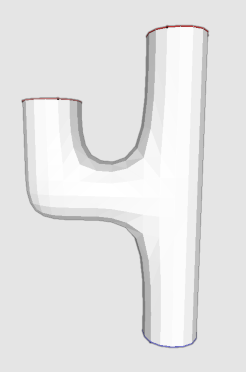

You can also place constraints elsewhere on the model to control the knitting direction, and use the <kbd>R</kbd> key to cut out a region around a constraint (useful for starting/ending on meshes without boundaries).

### Step 2: Peeling/Linking

Now that constraints are specified, the rest of the steps proceed automatically. However, the interface can provide visualization tools to show you what is happening.

#### Manual method:

Load the cactus object and the constraints into the interface. The ```obj-scale``` parameter tells the interface how much to scale the object, while the ```stitch-width``` and ```stitch-height``` parameters give the stitch size relative to the scaled object. The ```save-traced:``` parameter tells the interface where to save its traced stitches.

```
./interface obj:misc-cactus.obj load-constraints:misc-cactus.cons obj-scale:10.0 stitch-width:3.66 stitch-height:1.73 save-traced:misc-cactus.st
```

Press the <kbd>p</kbd> key to step through peeling:


During peeling, you can use the <kbd>g</kbd> key to show or hide the portions of the row-column graph created so far, and the <kbd>s</kbd> key to toggle whether the original model, interpolated value, or current slice model are being shown:

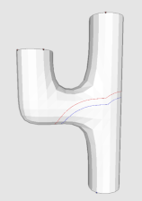 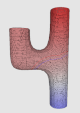 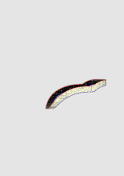
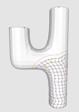  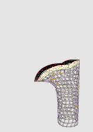

Once the peeling has finished, you can press <kbd>t</kbd> to create and save the traced path:

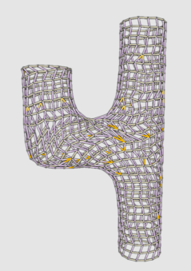 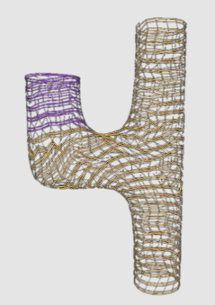

#### Automatic method:

If you don't want to press <kbd>p</kbd> a whole lot, you can just pass the ```peel-step:N``` option to do ```N``` steps of peeling. ```peel-step:-1``` will peel until the mesh is finished.

```
./interface obj:misc-cactus.obj load-constraints:misc-cactus.cons obj-scale:10.0 stitch-width:3.66 stitch-height:1.73 save-traced:misc-cactus.st peel-step:-1
```

### Step 3: Scheduling

Now that the traced stitches have been created, they need to be assigned knitting machine needles. We call this step scheduling, and it has its own executable, called ```schedule```.
The only parameters used by schedule are ```st:``` which gives an input stitches file and ```js:``` which gives an output javascript file:

```
./schedule st:misc-cactus.st js:misc-cactus.js
```

Schedule doesn't have an UI; it just does a relatively large combinatorial search and then dumps its output into a javascript file.

### Step 4: Knitout

Running the javascript file created by ```schedule``` will create knitout instructions, ready for use on your machine:
```
NODE_PATH=.. node misc-cactus.js out:misc-cactus.k
```

Note that the javascript file created by ```schedule``` uses some helper functions defined in the [```node_modules/autoknit.js```](node_modules/autoknit.js) file to do things like cast on tubes, bring in/out yarns, and perform transfers. You may want to customize ```autoknit.js``` for your machine.

## Status By Pipeline Step

This implementation is mostly complete, but is not fully working.

- Interface/wrapper - working.
- Model (obj) loading - working.
- Constraint specification - working.
- Peeling - mostly working.
    - Could be improved to handle ending with short rows.
    - Could be improved to deal with orphaned chains.
- Linking (including split/merge cases) - working.
- Tracing - mostly working.
    - Could be improved with more extensive ancestor traversal when tucking at the ends of short rows.
    - Sometimes generates short yarns; next-stitch-picking heuristic could be improved.
    - Might want to add a lazy vs eager switch for moving to the next row after splits. (Currently, the behavior is eager).
- Scheduling - working for small cases only.
    - Need to add a greedy version (currently only optimal is used).
- Knitting instructions -- mostly working.
    - Need a better yarn-in function for split tubes that tucks on front/back and then drops later.
    - Should add the option to use separate yarn for starting tubes
	- Should add the option to tuck yarn in from the edge of the beds
